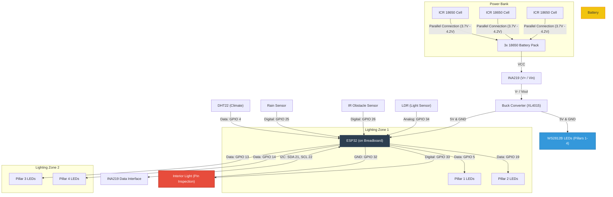

# 🔌 Smart Street Lighting System - Circuit Diagram (No PIR)

This document provides the technical wiring and circuit architecture for the Smart Street Lighting System. As requested, the **PIR Motion Sensor has been excluded** from this configuration, relying on the **IR Obstacle Sensor** for localized traffic detection.

---

## 📐 Schematic Diagram (Mermaid)

---

## 📌 Detailed Pinout Table

| Component | ESP32 Pin | Function | Notes |
| :--- | :--- | :--- | :--- |
| **LDR** | `GPIO 34` | Analog Input | Measures ambient light levels. |
| **IR Sensor** | `GPIO 26` | Digital Input | Detects traffic/obstacles (Active LOW). |
| **Rain Sensor** | `GPIO 25` | Digital Input | Detects precipitation (Active LOW). |
| **DHT22** | `GPIO 4` | Data | Climate monitoring (10k Pull-up recommended). |
| **INA219** | `GPIO 21 (SDA)` | I2C Data | Power/Battery monitoring. |
| **INA219** | `GPIO 22 (SCL)` | I2C Clock | Power/Battery monitoring. |
| **Pillar 1** | `GPIO 5` | WS2812B Data | Zone 1 illumination. |
| **Pillar 2** | `GPIO 19` | WS2812B Data | Zone 1 illumination. |
| **Pillar 3** | `GPIO 13` | WS2812B Data | Zone 2 illumination. |
| **Pillar 4** | `GPIO 14` | WS2812B Data | Zone 2 illumination. |
| **Light Box** | `GPIO 33` | LED Anode (+) | Interior light for ESP32 pin inspection. |
| **Light Box** | `GPIO 32` | LED Cathode (-) | Software-controlled Ground. |

---

## ⚡ Power Considerations

> [!WARNING]
> **Voltage Threshold Discrepancy:**
> You have requested a **parallel** connection for the three ICR 18650 cells. This results in a nominal voltage of **3.7V** (4.2V max). 
> However, the current firmware (`Smart_Street_Lighting_System.ino`) has the following safety thresholds:
> * `BATTERY_LOW = 10.5V`
> * `BATTERY_CRITICAL = 9.0V`
>
> With a parallel battery pack, the system will permanently trigger the **Critical Low Battery** state. To fix this, you should either:
> 1.  Wire the cells in **Series (3S)** to reach ~11.1V.
> 2.  **Update the code** thresholds to match a single-cell parallel voltage (e.g., Low = 3.5V, Critical = 3.2V).

*   **INA219 Placement:** The INA219 is now placed on the high-side between the battery bank and the Buck Converter to monitor the total power draw and battery discharge rate.
*   **Breadboard Setup:** The ESP32 should be centered on a standard breadboard, ensuring the I2C lines (SDA/SCL) and sensor inputs are short and well-grounded.
*   **Common Ground:** Ensure the battery ground, ESP32 ground, and LED ground are all tied together at a single point (star ground) to prevent flickering.

