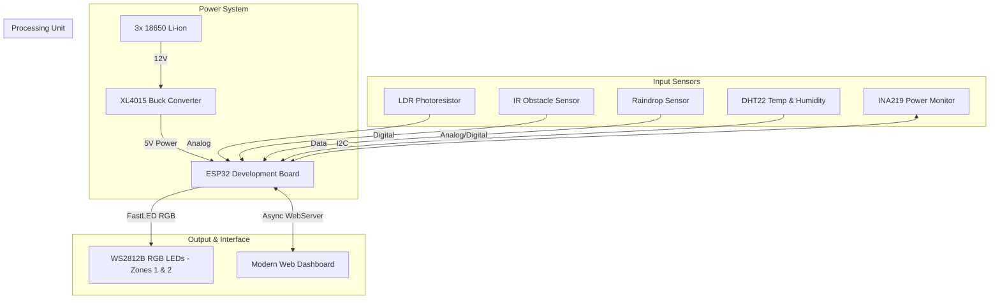

<div align="center">

# 🌆 Smart Street Lighting System
**ESP32 & Li-ion Powered Adaptive Lighting Solution**


</div>

<br/>

## 📌 Overview

This project implements a **Smart Street Lighting System** designed to automatically adjust illumination based on real-time environmental conditions, including **ambient light, traffic motion, weather events, and battery health**. 
Powered by an **ESP32 microcontroller**, a Li-ion battery bank, and a suite of intelligent sensors, it serves as an **energy-efficient, adaptive, and scalable lighting solution** for modern smart cities.

---

## ⚡ Key Features

* 🌙 **Automatic Day/Night Detection:** Uses an LDR to activate lights only when necessary.
* 🚗 **Adaptive Traffic Response:** Uses **IR Obstacle Sensors** to detect activity, instantly brightening lights for safety.
* 🌧️ **Weather-Adaptive Modes:** Rain sensors trigger a **warm white (3000K)** color profile. High humidity triggers a warm amber fog mode.
* 🌡️ **Live Climate Monitoring:** DHT22 tracks real-time temperature and humidity.
* 🔋 **Battery Protection System:** An INA219 sensor monitors power draw, scaling down brightness automatically to extend battery life.
* 🌈 **Smart RGB Street Lights:** Individually addressable WS2812 LEDs with smooth transitions and dynamic colors.
* ☀️ **High-Efficiency Power Management:** Integrated BMS ensures safe and continuous operation.
* 🌐 **Modern Web Dashboard:** A responsive interface for telemetry, charts, and remote control.
* 🕒 **Time-of-Day Dimming:** NTP-synced logic drops brightness during midnight hours (12 AM - 6 AM).
* ⚡ **Dual-Core Asynchronous Architecture:** Utilizes **FreeRTOS** to handle the Web Server on Core 0 and LED/Sensor logic on Core 1 for zero-latency performance.
* 🚀 **Instant Startup:** Non-blocking WiFi initialization—lights and sensors work immediately.
* 🔦 **Physical Flash:** Maintenance command to blink the street lights for identification.
* 🥳 **Backend Party Mode:** Dynamic color sequences now handled directly by the ESP32 for stability.

---

## 🧠 System Architecture

The architecture is divided into four core domains:

* **Input Sensors:** DHT22 (Climate), Raindrop Module (Weather), LDR (Light), IR Obstacle Sensor (Traffic Detection).
* **Processing Unit:** ESP32-S Development Board.
* **Output:** WS2812B RGB Smart LEDs (configured in independent zones).
* **Power System:** 3× 18650 Li-ion Batteries ➔ XL4015 Buck Converter (5V output).



---

## 🔌 Wiring & Pinout

| Component       | Connection                                        |
| --------------- | ------------------------------------------------- |
| **WS2812 Pillar 1** | Data → **GPIO 5** |
| **WS2812 Pillar 2** | Data → **GPIO 19** |
| **WS2812 Pillar 3** | Data → **GPIO 13** |
| **WS2812 Pillar 4** | Data → **GPIO 14** |
| **IR Sensor**   | OUT → **GPIO 26** (Pull-Up) |
| **LDR**         | Voltage divider → **GPIO 34** (Analog) |
| **Rain Sensor** | Digital → **GPIO 25** (Pull-Up) |
| **INA219**      | SDA → GPIO 21, SCL → GPIO 22 |
| **DHT22**       | Data → **GPIO 4** (with 10k pull-up) |
| **Light Box**   | Anode → **GPIO 33**, Cathode → **GPIO 32** | Interior Inspection Light |

---

## 🤖 Autonomous Logic

The system operates autonomously by default, reacting to contextual changes:

* **Daytime:** Lights OFF.
* **Nighttime (Idle):** Lights ON at a dim, soft-glow baseline.
* **Midnight (12 AM - 6 AM):** Drops to 50% brightness to conserve power.
* **Traffic Detected:** Ramps up to 100% brightness instantly, holding briefly before fading back down.
* **Rain Detected:** Switches LEDs to a **Warm White (3000K)** color profile at **80% brightness** for better visibility.
* **Fog Detected:** High humidity (>90%) triggers a **Warm Yellow/Amber (2700K)** profile at **55% brightness** to reduce glare.
* **Low Battery:** Caps maximum brightness. At critical voltage levels, locks to minimum safe brightness.

---

## 🏗️ Physical Build & Maquette

The system is implemented on a **miniature smart city model (maquette)** featuring painted roads, a hidden control unit, and designated sensing zones.

**Recommended 1-Meter Configuration:**
*   **Pillars:** 4 street light pillars (~25cm height each).
*   **LED Density:** 2 x WS2812B LEDs per pillar (8 LEDs total).
*   **Zones:**
    *   **Zone 1:** First 2 pillars (LEDs 0-3).
    *   **Zone 2:** Last 2 pillars (LEDs 4-7).

---

## 💻 Web Dashboard

The ESP32 hosts a fully responsive, modern web dashboard accessible from any device on the local WiFi network.

<details>
<summary><strong>✨ View Dashboard Capabilities</strong></summary>

* **Live Telemetry:** Monitor Battery Voltage, Current Draw, Temperature, Humidity, and active Weather States.
* **Interactive Charts:** View real-time graphs for voltage trends and motion frequency.
* **Manual Overrides:** Switch to "OVERRIDE" mode to force specific zones ON, OFF, or to custom brightness levels.
* **Customization:** Built-in RGB color picker to alter the default idle glow.
* **Party Mode:** A demonstration sequence that cycles colors dynamically.
</details>

### 🖥️ Dashboard UI & Live Demo
* **`docs/demo.html`**: A standalone frontend demo of the dashboard.
* **`dashboard.h`**: This header contains the HTML/CSS/JS served by the ESP32.
* **API Splitting**: The dashboard uses independent endpoints (`/status`, `/history`) to ensure high UI responsiveness.

**Access Instructions:**
1. Connect to the same WiFi network as the ESP32.
2. Open the Serial Monitor in Arduino IDE (115200 baud) to verify connectivity.
3. Access the dashboard via the fixed IP: `http://172.16.147.12` or via the network name: `http://smart-street-lighting.3m`.

---

## 🚀 Installation

### 1. Download and Install the Arduino IDE
Download the latest version of the Arduino IDE from the official site: [Arduino Software](https://www.arduino.cc/en/software)

### 2. Install the ESP32 Board
1. Open the Arduino IDE.
2. Go to `File > Preferences`.
3. In the "Additional Board Manager URLs" field, add the following URL:
   ```sh
   https://raw.githubusercontent.com/espressif/arduino-esp32/gh-pages/package_esp32_index.json
   ```
4. Click OK to save.
5. Go to `Tools > Board > Boards Manager`.
6. Search for "**ESP32**", then click **Install** on the package developed by Espressif Systems.
7. Once installed, go to `Tools > Board` and select your ESP32 board model (e.g., *ESP32 Dev Module*).

### 3. Install Libraries
Go to `Sketch > Include Library > Manage Libraries`. Search for and install:
* `FastLED`
* `DHT sensor library`
* `Adafruit Unified Sensor`
* `Adafruit INA219`

> [!NOTE]
> **FastLED Compile Error:** If you get a `"structured bindings only available with -std=c++17"` error while compiling,<br>open `Arduino/libraries/FastLED/src/platforms/shared/active_strip_data/active_strip_data.cpp` and change the structured bindings (`for (const auto &[stripIndex, stripData] : mStripMap)`) to traditional pair-based access (`for (const auto &entry : mStripMap)` and use `int stripIndex = entry.first;`).

### 4. Upload the Code
1. Connect your ESP32 to your PC via USB.
2. Open the project `.ino` file in Arduino IDE.
3. Select the correct Port and Board under `Tools`.
4. Click the **Upload** button to flash the code onto your ESP32.

---

## 🌐 Connectivity & Access

The system supports two concurrent ways to access the dashboard:

### 1. Mobile Hotspot (STA Mode)
* **SSID:** `[Network name you connect to]`
* **Static IP:** `172.16.147.12`
* **Access Link:** [http://172.16.147.12](http://172.16.147.12)   *(Note: you must change the gateway IP to your network gateway IP in the code)*
* **mDNS:** [http://Smart-Street-Lighting.local](http://Smart-Street-Lighting.local) *(Note: you must have iTunes installed on Windows or use a different browser on Android)*

### 2. Router Connection (STA Mode)
* **SSID:** `[Network name you connect to]`
* **Static IP:** `192.168.1.12`
* **Access Link:** [http://192.168.1.12](http://192.168.1.12)   *(Note: you must change the gateway IP to your network gateway IP in the code)*
* **mDNS:** [http://Smart-Street-Lighting.local](http://Smart-Street-Lighting.local) *(Note: you must have iTunes installed on Windows or use a different browser on Android)*

### 3. Direct Connection (AP Mode)
* **WiFi Name:** `Smart Street Lighting System`
* **Password:** `12345678`
* **Custom Link:** [http://smart-street-lighting.3m](http://smart-street-lighting.3m)
* **mDNS:** [http://Smart-Street-Lighting.local](http://Smart-Street-Lighting.local) *(iOS/macOS only)*

---

## ❓ FAQ

**❓ Why is my ESP32 getting a random IP instead of my Static IP?**
* Ensure the `gateway` address in the code matches your router's IP (e.g., `192.168.1.1` , `192.168.0.1` or `172.16.147.1` *(for hotspot)*), you must update the `local_IP` and `gateway` in the `.ino` file. If they don't match, the ESP32 will fall back to DHCP.
* Double-check that the Static IP you chose isn't already taken by another device.

**❓ Why does `http://Smart-Street-Lighting.local` not work?**
* **Windows:** You may need to install [Bonjour Print Services](https://support.apple.com/kb/DL999) or have iTunes installed for `.local` resolution.
* **Android:** Most Android browsers do not support mDNS by default. Use the IP address instead or For the best mobile experience, connect directly to the **"Smart Street Lighting System"** WiFi and use the custom link `http://smart-street-lighting.3m`.
* **Apple (iOS/macOS):** Should work natively.
* **Linux:** Should work natively.

**❓ What if the ESP32 board doesn’t show up in the Arduino IDE?**
* Make sure you have installed the correct USB drivers. If your ESP32 uses the CH340 chip, you can download the driver here: [CH340 Driver Download (CH341SER.EXE)](https://cdn.sparkfun.com/assets/learn_tutorials/8/4/4/CH341SER.EXE)
* Try a different USB cable or port (some cables are power-only).
* Restart the Arduino IDE after installing the ESP32 board package.

**❓ How do I reset the ESP32 if it fails to upload?**
* Hold the **BOOT** button on the board while clicking the Upload button in Arduino IDE.
* Release the BOOT button when it starts connecting.

**❓ What if the sensors (DHT22 or INA219) read 0 or NaN?**
* **INA219**: Verify the I2C wiring (SDA to GPIO 21, SCL to GPIO 22) and ensure the sensor has a common ground with the ESP32.
* **DHT22**: Ensure you have a 10k pull-up resistor between the Data pin and 3.3V.

**❓ The dashboard is not loading or is unresponsive.**
* Open the Serial Monitor (115200 baud) to verify the ESP32's current IP address and connection status.
* Ensure you are connected to the correct WiFi network (either your router or the ESP32 AP).
* Try refreshing the page or using a different browser (Chrome/Edge recommended).

**❓ Can I use a different board?**
* The code is written for the ESP32 platform. Other boards would require code modifications.

---

## ⚠️ Safety Notes
* **Battery Handling:** Ensure correct wiring with the BMS to prevent over-discharge or short circuits.
* **Voltage Regulation:** Always test the output of the buck converter with a multimeter *before* connecting it to the ESP32.
* **Weatherproofing:** Do not expose raw electronics to water. Only the external sensing probes (like the rain board) should be exposed.

---

## 📈 Future Improvements
* 📱 **Mobile App Integration:** Develop a companion app using React Native or Flutter.
* 🧠 **AI Traffic Prediction:** Implement machine learning to anticipate traffic patterns and pre-light roads.
* 📡 **Mesh Networking:** Add LoRaWAN support to connect multiple ESP32 nodes across a wide area.

---

## 📬 Contact
Mohamed Tarek - [@MohamedTarek3M](https://twitter.com/MohamedTarek3M) - mohamedtarekcontact@gmail.com

**Project Link:** [Smart-Street-Lighting-System](https://github.com/MohamedTarek3M/Smart-Street-Lighting-System)

---

**Last Updated:** March 3, 2026
